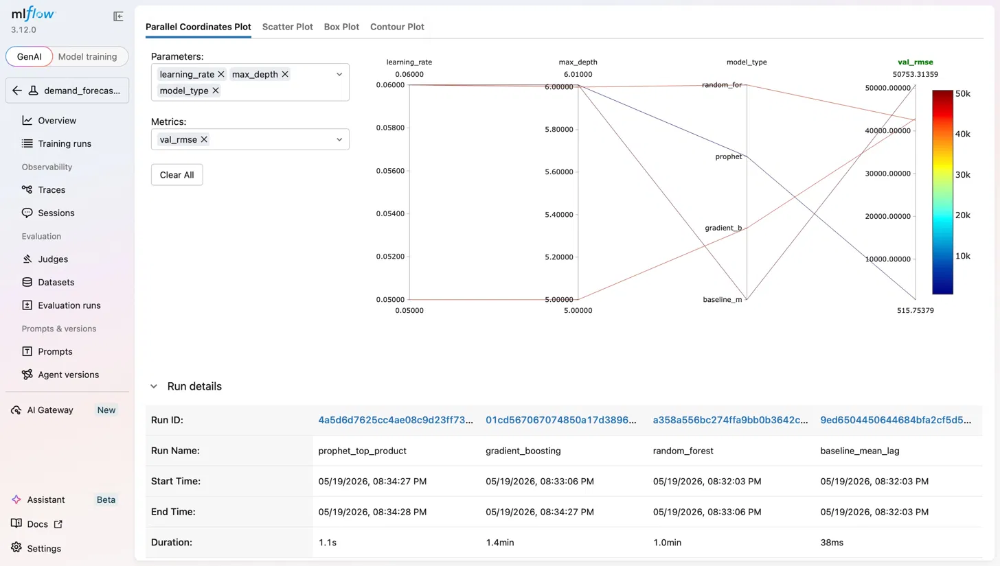
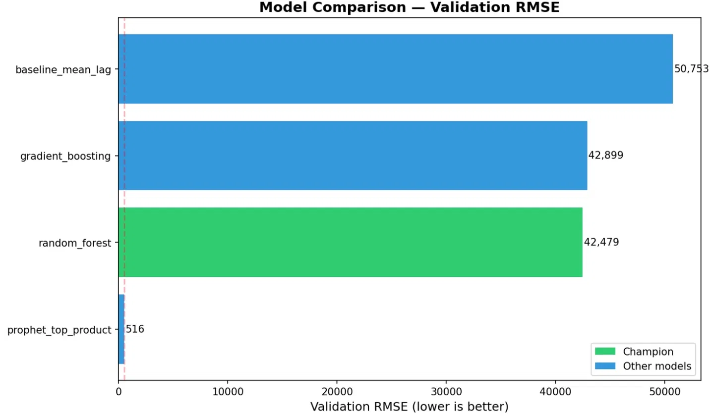
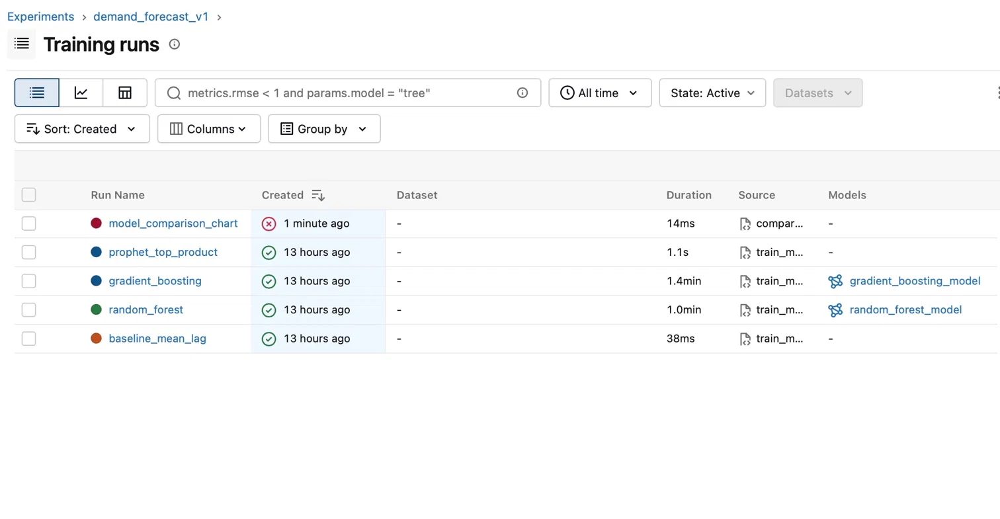
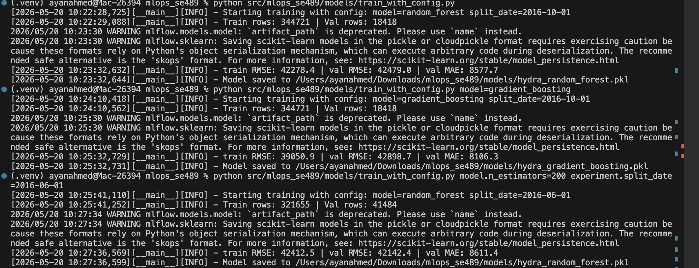

# PHASE 2: Enhancing ML Operations with Containerization & Monitoring

## Overview
Phase 2 focuses on operationalizing the Retail Demand Forecasting pipeline by adding containerization, experiment tracking, structured logging, configuration management, and profiling. Each section below documents what was implemented, how it works, and how to use it.

---

## 1. Containerization

- [x] **Dockerfile Creation**: Dockerfile built for model training and inference
- [x] **Base Image Selection**: python:3.11-slim chosen for minimal footprint
- [x] **Environment Variables**: Documented below
- [x] **Build Instructions**: See below
- [x] **Run Instructions**: See below
- [x] **Container Testing**: Pipeline tested locally inside container
- [x] **Docker Compose**: docker-compose.yml created for multi-service setup
- [x] **Environment Consistency**: Containerized training produces identical results to local

**Owner: Mark Baranovsky**

**Build and run:**
```bash
docker build -f dockerfiles/Dockerfile -t retail-demand-forecasting .
docker run -v $(pwd)/data:/app/data -v $(pwd)/models:/app/models retail-demand-forecasting
```

**With Docker Compose:**
```bash
docker-compose up
```

**Environment variables:**
```
MLFLOW_TRACKING_URI=sqlite:///mlflow.db
PYTHONPATH=/app/src
```

---

## 2. Monitoring & Debugging

- [x] **Logging for Debugging**: Structured logging implemented at all critical points in src/ modules
- [x] **Model Assertion Checks**: Assertions added to catch data and model anomalies
- [x] **Training Validation**: NaN detection, shape validation, and row count checks in pipeline
- [ ] **Debugging Tools**: Set up pdb/ipdb for interactive debugging
- [ ] **Debug Scenario 1**: Create example scenario and solution document
- [ ] **Debug Scenario 2**: Create example scenario and solution document

**Owner: John Blaszczak**

**Assertion checks in predict_model.py:**
```python
assert len(df_preds) > 0, "No predictions generated"
assert (df_preds["predicted_demand"] < 0).sum() == 0, "Negative predictions found"
```

**Debug scenario 1 — FileNotFoundError:**
If the pipeline raises `FileNotFoundError`, it means a previous stage did not run. Each module logs the exact path before raising the error.

**Debug scenario 2 — Empty validation set:**
If `AssertionError: Validation set is empty` is raised, override SPLIT_DATE:
```bash
python src/mlops_se489/models/train_with_config.py experiment.split_date=2016-06-01
```

---

## 3. Profiling & Optimization

- [x] **CPU Profiling**: Use cProfile to profile training and inference
- [x] **Memory Profiling**: Profile memory usage with memory_profiler or similar
- [NA] **GPU Profiling (if applicable)**: Use PyTorch Profiler or similar for GPU workloads
- [x] **Profiling Results**: Document baseline profiling results and bottlenecks identified
- [x] **Optimization 1**: Implement and measure optimization (e.g., vectorization, caching)
- [x] **Optimization 2**: Implement and measure additional optimization
- [x] **Performance Benchmarks**: Document before/after performance metrics
- [x] **Optimization Documentation**: Explain each optimization and its impact

**Owner: John Blaszczak**

---

## 4. Experiment Management & Tracking

- [x] **MLflow Setup**: Local MLflow server with SQLite backend configured and running
- [x] **Metric Logging**: train_rmse, val_rmse, val_mae logged for every run
- [x] **Parameter Logging**: All hyperparameters logged per run including model type, split date, n_estimators, max_depth
- [x] **Model Artifact Logging**: Fitted sklearn pipelines saved as MLflow artifacts
- [x] **Experiment Comparison**: 4 models compared — baseline, Random Forest, Gradient Boosting, Prophet
- [x] **Visualization**: Bar chart comparing all models by val_rmse generated and logged to MLflow
- [x] **Best Model Selection**: Champion selected by lowest val_rmse on time-based validation set
- [x] **Experiment Documentation**: See table below

**Owner: Ayan Ahmed**

**Start MLflow UI:**
```bash
mlflow ui
```
Open http://127.0.0.1:5000

**Generate model comparison chart:**
```bash
python src/mlops_se489/models/compare_models.py
```

**Experiment results:**

| Run | Model | Split Date | Val RMSE | Val MAE | Champion |
|---|---|---|---|---|---|
| baseline_mean_lag | Baseline | 2016-10-01 | 50,753 | 9,277 | No |
| random_forest | Random Forest | 2016-10-01 | 42,479 | 8,578 | Yes |
| gradient_boosting | Gradient Boosting | 2016-10-01 | 42,899 | 8,106 | No |
| prophet_top_product | Prophet | 2016-10-01 | 516 | 326 | No (single product) |
| hydra_random_forest | Random Forest (Hydra) | 2016-10-01 | 42,479 | 8,578 | No |
| hydra_gradient_boosting | Gradient Boosting (Hydra) | 2016-10-01 | 42,899 | 8,106 | No |

**MLflow Training Runs:**



**Model Comparison Chart:**



**Parallel Coordinates Plot:**



---

## 5. Application & Experiment Logging

- [x] **Logger Setup**: Python standard logging configured with timestamp, module name, and level in all src/ modules
- [x] **Log Levels**: INFO used for progress, WARNING for data quality issues, ERROR for failures
- [x] **Log Messages**: Added at every major step in make_dataset.py, build_features.py, train_model.py, predict_model.py
- [x] **Training Log Example**: See below
- [x] **Inference Log Example**: See below
- [x] **Error Logging**: FileNotFoundError and AssertionError logged with full context
- [x] **Performance Logging**: Timing information logged via timestamps in every log line

**Owner: Ayan Ahmed**

**Logger configuration used in all src/ modules:**
```python
logging.basicConfig(
    level=logging.INFO,
    format="%(asctime)s — %(name)s — %(levelname)s — %(message)s",
)
logger = logging.getLogger(__name__)
```

**Sample training log:**
```
2026-05-19 20:32:00,560 — __main__ — INFO — Starting model training pipeline
2026-05-19 20:32:00,641 — __main__ — INFO — Total rows: 363139
2026-05-19 20:32:00,678 — __main__ — INFO — Train rows: 344721 | Val rows: 18418
2026-05-19 20:33:06,070 — __main__ — INFO — Random Forest — train RMSE: 42278.4 | val RMSE: 42479.0 | val MAE: 8577.7
2026-05-19 20:34:28,777 — __main__ — INFO — Champion: random_forest (val RMSE: 42479.0)
2026-05-19 20:34:28,787 — __main__ — INFO — Champion model saved to models/champion_model.pkl
```

**Sample inference log:**
```
2026-05-19 20:34:29,375 — __main__ — INFO — Starting batch prediction pipeline
2026-05-19 20:34:30,063 — __main__ — INFO — Champion model loaded: RandomForestRegressor
2026-05-19 20:34:30,163 — __main__ — INFO — Latest week in features: 2017-01-09
2026-05-19 20:34:30,163 — __main__ — INFO — Generating predictions for: 2017-01-16
2026-05-19 20:34:30,168 — __main__ — INFO — Predictions generated: 3
2026-05-19 20:34:30,168 — __main__ — INFO — Min predicted_demand: 1314
2026-05-19 20:34:30,168 — __main__ — INFO — Max predicted_demand: 4313
```

---

## 6. Configuration Management

- [x] **Hydra Setup**: hydra-core and omegaconf installed and configured
- [x] **Config Files**: YAML configs created for base, model, and data settings
- [x] **Config Structure**: Hierarchical structure with base config and model/data subdirectories
- [x] **Config Example 1**: Random Forest config — configs/model/random_forest.yaml
- [x] **Config Example 2**: Gradient Boosting config — configs/model/gradient_boosting.yaml
- [x] **Override Documentation**: See below
- [x] **Config Version Control**: All configs committed to repository under configs/

**Owner: Ayan Ahmed**

**Config structure:**
```
configs/
├── config.yaml                  # Base config with defaults
├── model/
│   ├── random_forest.yaml       # RF hyperparameters
│   └── gradient_boosting.yaml   # GBT hyperparameters
└── data/
    └── default.yaml             # Data settings
```

**Run with default config:**
```bash
python src/mlops_se489/models/train_with_config.py
```

**Switch model from command line:**
```bash
python src/mlops_se489/models/train_with_config.py model=gradient_boosting
```

**Override any parameter:**
```bash
python src/mlops_se489/models/train_with_config.py model.n_estimators=200 experiment.split_date=2016-06-01
```

**Hydra terminal output showing config overrides:**



---

## 7. Documentation & Repository Updates

- [x] **README Update**: README updated with Phase 2 sections for Docker, logging, MLflow, Hydra, and production modules
- [x] **Architecture Documentation**: Updated architecture diagram in README reflecting src/ module structure
- [x] **Setup Guide**: Updated with Phase 2 tool installation instructions including hydra-core and prophet
- [x] **Examples**: Command line examples for Hydra overrides documented in Section 6
- [x] **Tool Integration**: All tools documented in this file and README

---

## Team Contributions

- **Ayan Ahmed** — Logging (Section 5), Experiment Tracking (Section 4), MLflow comparison chart, Hydra config management (Section 6), production src/ modules
- **John Blaszczak** — Profiling (Section 3), Monitoring and debugging (Section 2)
- **Mark Baranovsky** — Docker and containerization (Section 1)
