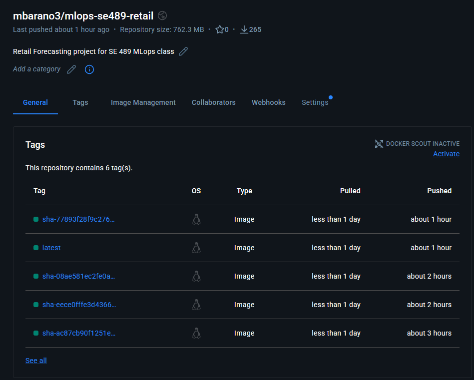
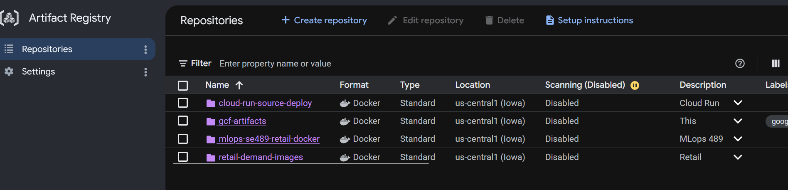
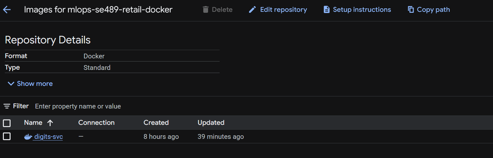
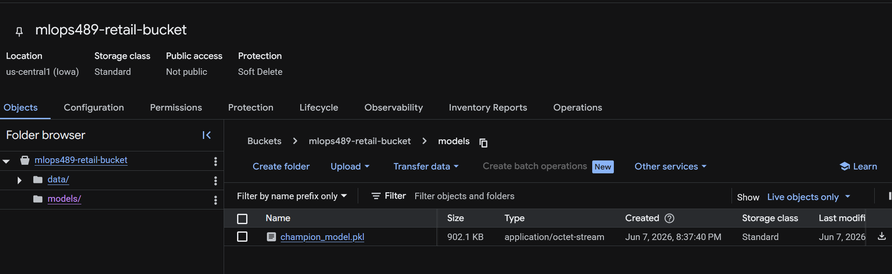
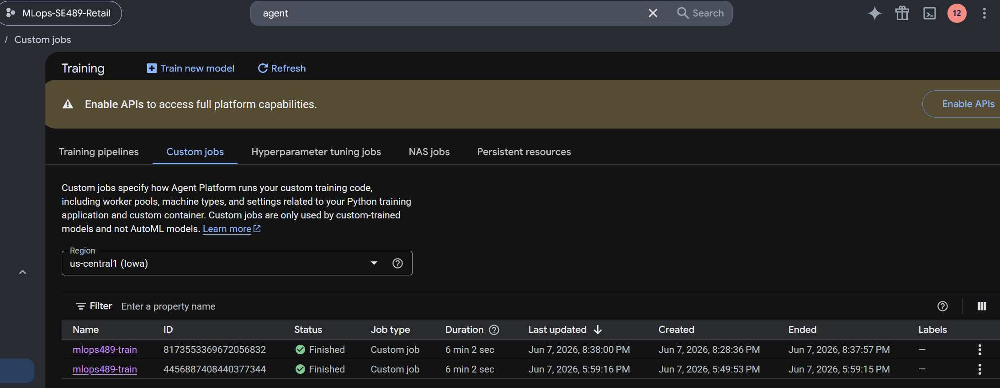
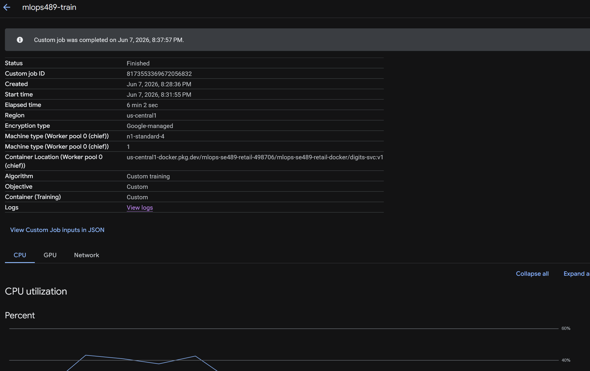
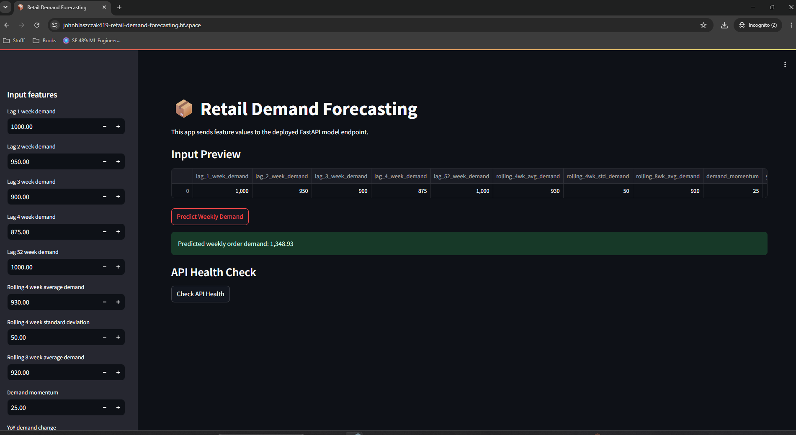
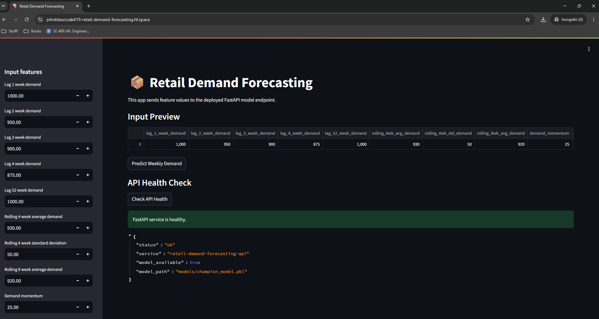

# PHASE 3: Continuous Machine Learning (CML) & Deployment

## Overview
Phase 3 implements continuous integration/continuous deployment (CI/CD) pipelines and productionizes Retail Demand Forecasting on cloud infrastructure. This phase covers automated testing, containerized workflows, CML integration, and multi-platform deployment options including GCP, Cloud Run, and serverless functions.

---

## 1. Continuous Integration & Testing

- [x] **Unit Tests**: Write pytest test scripts for data processing and model components
- [x] **Integration Tests**: Create integration tests for full training pipeline
- [ ] **Test Coverage**: Aim for >80% code coverage with pytest-cov
- [x] **GitHub Actions - Tests**: Create workflow for running tests on every push
  - [x] Trigger on: push to main/develop branches and PRs
  - [x] Test across multiple Python versions if applicable
  - [x] Report coverage metrics
- [x] **GitHub Actions - Code Quality**: Create workflow for:
  - [x] Running ruff linter
  - [x] Type checking with mypy
  - [x] Formatting checks
- [x] **GitHub Actions - Docker Build**: Create workflow for building Docker image
  - [x] Build on PR and main branch push
  - [x] Test built image
- [x] **Pre-commit Hooks**: Set up pre-commit hooks for:
  - [x] Formatting (black/ruff)
  - [x] Linting
  - [x] Type checking
  - [x] Trailing whitespace
- [x] **Test Documentation**: Document how to run tests locally and in CI
### 1.1 Unit Testing with pytest

- **Status:** Completed
- **Repo evidence:** `tests/`
- **Screenshot evidence:** `reports/figures/screenshots/local_pytest_coverage.png`

Pytest tests were verified for data processing, feature engineering, model, training, prediction, evaluation, and utility components. The test command runs with coverage reporting so the team can see which modules are covered and where future test improvements are needed.

### 1.2 GitHub Actions CI Workflow

- **Status:** Completed
- **Repo evidence:**
  - `.github/workflows/tests.yml`
  - `.github/workflows/code-quality.yml`
  - `.github/workflows/ci.yml`
- **Screenshot evidence:** `reports/figures/screenshots/github_actions_green.png`, `reports/figures/screenshots/local_ruff_mypy_passed.png`

GitHub Actions workflows were added for automated testing and code quality checks. The workflows run pytest, Ruff linting, Ruff formatting checks, and mypy type checking on pull requests and pushes. The legacy CI workflow was also fixed so it checks production code, scripts, and tests instead of failing on notebook files.

### 1.3 Pre-commit Hooks

- **Status:** Completed
- **Repo evidence:** `.pre-commit-config.yaml`
- **Screenshot evidence:** `reports/figures/screenshots/precommit_passed.png`


### Local CI/Test Commands

To run the same checks locally before opening a pull request:

```bash
python3 -m pytest tests/ -v --cov=src --cov-report=term-missing
python3 -m ruff check src scripts tests
python3 -m ruff format --check src scripts tests
python3 -m mypy src/mlops_se489 --ignore-missing-imports
pre-commit run --all-files
```

GitHub Actions automatically runs automated tests, linting, formatting checks, type checks, and pre-commit-style validation on pull requests and pushes. The workflows test Python 3.11 and Python 3.12.
---

## 2. Continuous Docker Building & CML

- [x] **Automated Docker Builds**: Configure Docker build pipeline triggered by:
  - [x] Commits to main branch
  - [x] Version tags
  - [x] Manual workflow dispatch
- [x] **Docker Push**: Implement push to container registry (Docker Hub, GitHub Container Registry, or GCP)

The workflow yaml can be found at .github\workflows\docker-publish.yaml

You first need to creata PAT in Docker Hub by clicking on your avatar -> account settings -> Personal Access Tokens -> Generate New Token. Copy the token right away.

Now navigate to the github repository -> Settings -> Secrets and Variables -> Actions -> New Repository Secret.
The three secrets you needs are:
DOCKER_HUB_TOKEN = PAT token you copied
DOCKER_HUB_USERNAME = your dockerhub username
DOCKER_HUB_REPOSITORY = your dockerhub repository name

the docker publish yaml triggers on pushes and pulls from main and automagically builds the image and commits them to dockerhub.

In order to get the docker image locally run this command:
docker pull <your-username>/<your-repo>:latest

Make sure you mount the volumes so the image can use the dataset and save the models.
You can also changing entrypoint with --entrypoint python and run whatever script you want (eg.) -u -m mlops_se489.data.make_dataset

docker run --rm -it `
  --entrypoint python `
  -v ${PWD}/data:/app/data `
  -v ${PWD}/models:/app/models `
  mlops_se489 `
  -u -m mlops_se489.data.make_dataset

# 1. Pull the image
docker pull your-dockerhub-username/mlops_se489:latest

# 2. Tag it so Compose recognizes it as the local image
docker tag your-dockerhub-username/mlops_se489:latest mlops_se489:latest

# 3. Run your pipeline
docker compose up




* [x] **CML Initialization**: Initialize CML in repository
* [x] **CML Workflow**: Create GitHub Actions workflow for CML that:

  * [ ] Trains model on workflow runner
  * [x] Generates performance metrics
  * [ ] Creates visualizations/plots
  * [x] Comments results on PR
* [x] **CML Metrics Output**: Document format and sample output of CML metrics
* [ ] **CML Plots**: Generate sample plots and document in CML workflow
* [x] **Model Comparison**: Create CML output showing comparison of current vs. baseline model
* [x] **Workflow Documentation**: Document CML workflow setup and customization
### 2.1 Automated Docker Builds

- **Status:** Completed
- **Repo evidence:**
  - `.github/workflows/docker-publish.yaml`
  - `dockerfiles/Dockerfile`
- **Screenshot evidence:**
  - `reports/figures/screenshots/docker_workflow_triggers.png`
  - `reports/figures/screenshots/docker_workflow_green.png`

The Docker workflow builds the project image using the existing multi-stage Dockerfile from Phase 2. It is configured to run on pushes to `main`, version tags, pull requests to `main`, and manual workflow dispatch. This verifies that the container can be built automatically as part of the CI/CD pipeline.

### 2.2 Continuous Machine Learning (CML)

* **Status:** Completed
* **Repo evidence:**

  * `.github/workflows/cml.yml`
  * `reports/cml_report.md`
  * `scripts/profile_training.py`
  * `reports/profiling/training_cpu_profile.txt`
  * `reports/profiling/training_memory_usage.txt`
* **Screenshot evidence:** `reports/figures/screenshots/cml_pr_comment.png`

The CML workflow posts a model training report to pull requests so reviewers can inspect model performance before merging. The report includes validation RMSE and MAE values for the baseline model, Random Forest, Gradient Boosting, and Prophet demo model, along with the selected champion model. Profiling was cleaned up into a standalone script at `scripts/profile_training.py`, and the generated CPU and memory profiling outputs are saved under `reports/profiling/`.

### CML Report Metrics Summary

The CML report includes the following model results:

| Model              | Validation RMSE | Validation MAE |
| ------------------ | --------------: | -------------: |
| Baseline           |        50,753.3 |        9,277.3 |
| Random Forest      |        42,479.0 |        8,577.7 |
| Gradient Boosting  |        42,875.5 |        8,105.6 |
| Prophet demo model |           515.8 |          326.1 |

The selected champion model is **Random Forest** with validation RMSE **42,479.0**.


---

---

## 3. Deployment on GCP

- [x] **GCP Project Setup**: Create GCP project and enable necessary APIs
- [x] **Service Account**: Create service account with appropriate permissions for:
  - [x] Artifact Registry
  - [x] Vertex AI
  - [x] Cloud Run
  - [x] Cloud Functions
  - [x] Compute Engine

  Before you can create an artifact registry, you must enable the gcloud services:
  gcloud services enable artifactregistry.googleapis.com
  gcloud services enable cloudbuild.googleapis.com

- [x] **Artifact Registry**: Set up Artifact Registry for storing Docker images
  - [x] Create repository in Artifact Registry
  - [x] Configure authentication from CI/CD
  - [x] Push Docker images to registry

  To create an artifact registry:
  gcloud artifacts repositories create <repo-name> \
    --repository-format=docker \
    --location=us-central1 \
    --description="MLOps 489 Docker registry"

  To pull the repo, it exists here:
  <region>-docker.pkg.dev/<project-id>/<repo-name>

  The cloudbuild.yaml allows for the docker images to be built and pushed automatically

  To wire the trigger:
  Cloud Build -> Triggers -> Create Trigger
      Region: same as your connection.

    Source: 2nd gen.

    Repository: pick the linked repo from step 3.

    Event: Push to a branch.

    Branch: ^main$.

    Configuration: Cloud Build configuration file.

    Location: Exercises/GCPArtifactRegistry/cloudbuild.yaml.

    Under Substitution variables, add _REGION=us-central1, _REPO=<your-repo-name>, _IMAGE=digits-svc, _TAG=v1.

    Click Create.

  You can see your build in action in the Console -> Cloud Build -> History
  

  Verify that the image exists in the artifact registry:
  gcloud artifacts docker images list \
    us-central1-docker.pkg.dev/$(gcloud config get-value project)/mlops489-docker \
    --include-tags

  
  

  To pull the built image to your local machine:
  docker pull us-central1-docker.pkg.dev/<project-id>/mlops489-docker/digits-svc:v1

  Confirm it runs with:
  docker run --rm us-central1-docker.pkg.dev/<project-id>/mlops489-docker/digits-svc:v1

- [x] **Vertex AI Training (Option A)**: Set up custom training on Vertex AI
  - [x] Create training container image
  - [x] Configure training job specification
  - [x] Document how to submit training jobs
  

First setup a bucket to store your data and trained model.
Navigate to GCP Console homepage -> Cloud Storage -> Create
Set a name for your bucket, location should be us-central1, storage class standard, access control uniform

Verify the bucket exists
gcloud storage ls

push your data to the bucket using the google cloud site interface

You can submit a job with the following command:
gcloud ai custom-jobs create \
    --region=us-central1 \
    --display-name=mlops489-train \
    --config=config_cpu.yaml \
    --service-account=trainer-sa@<project-id>.iam.gserviceaccount.com

To Watch the job, you stream the jogs directly to your terminal, and you can also check the logs directly on the google cloud

gcloud ai custom-jobs stream-logs <job-id> --region=us-central1

Once the job is finished, it should show up as green as shown in the following screenshots. The trained model is stored in the cloud storage bucket
  
  

Cleaning up all jobs with the following commands:

Find any running jobs
gcloud ai custom-jobs list --region=us-central1 \
    --filter="state:JOB_STATE_RUNNING OR state:JOB_STATE_PENDING"

Cancel the running job
gcloud ai custom-jobs cancel <job-id> --region=us-central1

Delete all instances
gcloud compute instances list
gcloud compute instances delete mlops489-train --zone=us-central1-a --quiet

- [ ] **Compute Engine Training (Option B)**: Set up training on Compute Engine instance
  - [ ] Create VM instance with GPU if needed
  - [ ] Document SSH access and training process
  - [ ] Set up instance for automated training
- [x] **Model Registry**: Store trained models in GCS bucket with versioning
  - [x] Create GCS bucket for models
  - [x] Implement model upload from training
  - [x] Document model retrieval process
  
- [x] **FastAPI Service**: Create FastAPI application for model serving
  - [x] Define inference endpoint(s)
  - [x] Implement request validation
  - [x] Add health check endpoint
  - [x] Document API specification
- [x] **Cloud Functions Deployment (Option A)**: Deploy inference as Cloud Function
  - [x] Package model and FastAPI app for Cloud Functions
  - [x] Create Cloud Function with appropriate memory/timeout
  - [x] Configure HTTP trigger
  - [x] Document invocation and response format
- [ ] **Cloud Run Deployment (Option B)**: Deploy as containerized service on Cloud Run
  - [ ] Create Dockerfile optimized for Cloud Run
  - [ ] Test locally with Cloud Run emulator
  - [ ] Deploy to Cloud Run with auto-scaling
  - [ ] Document deployment process
- [x] **Streamlit/Gradio Deployment (Option C)**: Deploy demo app on HuggingFace Spaces
  - [x] Create Streamlit or Gradio interface for model
  - [x] Push to GitHub repository
  - [x] Deploy to HuggingFace Spaces
  - [x] Document feature walkthrough
- [x] **Load Testing**: Test deployment with load testing tool (locust, Apache JMeter)
  - [x] Establish baseline performance metrics
  - [x] Document scaling characteristics
- [x] **Monitoring Setup**: Configure Cloud Monitoring and Cloud Logging
  - [x] Set up log aggregation
  - [x] Create monitoring dashboards
  - [x] Set up alerts for anomalies

---

## 4. Documentation & Repository Updates

- [x] **Comprehensive README**: Update README with:
  - [x] Architecture diagram showing all components
  - [x] CI/CD pipeline overview
  - [x] Deployment instructions for each option (Cloud Run, Cloud Functions, HuggingFace)
  - [x] GCP setup and configuration guide
  - [x] How to invoke deployed models
  - [x] Monitoring and troubleshooting guide
  - [x] Cost estimation and optimization tips
- [x] **Deployment Guide**: Create detailed DEPLOYMENT.md with:
  - [x] Step-by-step GCP setup instructions
  - [ ] Cloud Run deployment procedure
  - [ ] Cloud Functions configuration
  - [ ] Environment variables and secrets management
  - [ ] Rollback procedures
- [ ] **API Documentation**: Document all endpoints with:
  - [ ] Request/response schemas
  - [ ] Example curl/Python requests
  - [ ] Error codes and messages
- [ ] **Architecture Documentation**: Include diagrams showing:
  - [ ] Data pipeline
  - [ ] Training pipeline
  - [ ] Inference/serving architecture
  - [ ] CI/CD workflow
- [ ] **Screenshots/Demos**: Add:
  - [ ] Cloud Run dashboard screenshot
  - [ ] Monitoring dashboard screenshot
  - [x] Streamlit/Gradio app screenshot
          
          
  - [ ] API response example
  - [x] CML workflow output sample
            
- [ ] **Troubleshooting Guide**: Document solutions for:
  - [ ] Common deployment errors
  - [ ] Authentication issues
  - [ ] Performance problems
  - [ ] Cost overruns
- [ ] **Resource Cleanup Reminder**: Create CLEANUP.md with instructions for:
  - [ ] Deleting GCP resources (VMs, databases, etc.)
  - [ ] Cleaning up Cloud Storage buckets
  - [ ] Disabling APIs to avoid charges
  - [ ] Cost monitoring recommendations
- [ ] **Contributing Guide Update**: Update CONTRIBUTING.md with:
  - [ ] CI/CD requirements
  - [ ] Testing requirements for PRs
  - [ ] Deployment process documentation
- [ ] **Changelog**: Maintain CHANGELOG.md documenting releases and deployments

---

> **Checklist:** Use this as a guide for documenting your Phase 3 deliverables.
